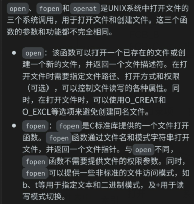
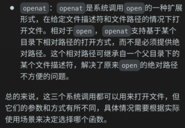
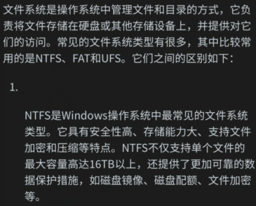
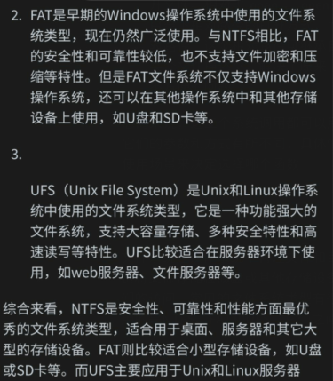
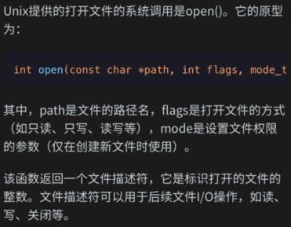
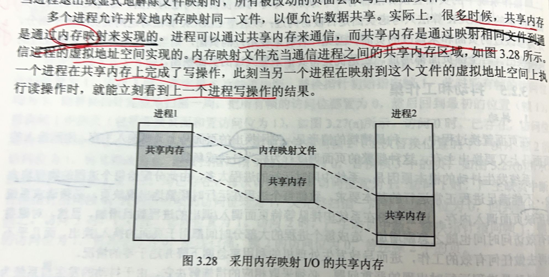

前期散列的列出来，针对暂时不理解的内容进行记录，后期整理并构建知识框架

408 100 王道的熟练掌握 120教材的绝对熟悉 130以上 黑书 作为科班对计算机的深入理解

## 前置内容

1.操作系统，微程序，编译器各自的职责?

## 进程管理

### 现代操作系统

### 6.s081

## 内存管理

1.页框的地址一定是连续的吗，如果存储器是低位交叉编制的方式会不会有影响
应该不会
存储器具体寻址的方式对cpu来说是透明的，cpu寻址并不知道对应地址到底是不是同一个存储芯片
所以一定是连续的
按行存储和按列存储是什么意思
是不是高位交叉编制和低位交叉编制？

2.

3.

## 文件管理

1.

2.open,fopen,openf 这几个系统调用的区别

2.

3.unix打开文件的系统调用

4.内存映射文件

Q:内存映射文件是不是就是pipe管道?

A:不是，内存映射文件和管道是两个不同的概念。

内存映射文件是一种通过将文件或其他设备映射到内存中的方式来访问文件或设备的方法。通过内存映射文件可以将文件或设备的内容直接映射到进程的地址空间中，可以像访问内存一样访问文件或设备的数据。这种访问方式通常比传统的文件读写方式更快且更简单。在C++中，可以使用标准库中的mmap()函数来实现内存映射文件。

管道是一种将一个进程的输出连接到另一个进程的输入的方法。通过管道可以实现两个进程之间的通信，一个进程将数据输出到管道中，另一个进程再从管道中读取数据。在Linux系统下，可以使用pipe()函数来创建一个管道，然后使用fork()函数来创建子进程，从而实现进程间通信。

Q:这里的文件映射到内存的地址空间中，映射的是这个文件所有的数据块还是索引块，还是fcb?
A:当将文件映射到内存中时，映射的是整个文件的数据块，而不仅仅是索引块或 FCB（文件控制块）。这种映射方式可以让进程直接访问文件的数据，而无需使用传统的文件读写方式。从进程的角度来看，文件被映射到了进程的地址空间中，进程可以像访问内存一样访问文件的数据块，非常方便和高效。

需要注意的是，将整个文件映射到内存中可能会占用较多的内存空间，因此需要谨慎使用，特别是对于大文件而言。为避免内存资源的浪费，可以使用部分内存映射文件（Partial Memory-mapped Files）的方式，只将文件的一部分映射到内存中。在 C++11 标准库中，可以使用 std::mmap() 函数来实现内存映射文件。

Q:mmap提供的参数是文件描述符吗?
A:是的，mmap 函数的第一个参数是文件描述符，用于指定要映射到内存中的文件。文件描述符是一种在 Linux 系统中用于标识文件的方法，每个打开的文件都有一个唯一的文件描述符，可以通过系统调用如 open() 或 creat() 来获取文件描述符。

mmap 函数的第二个参数是映射区的长度，用于指定映射到内存中的文件或其部分的大小。第三个参数是映射区的访问权限，包括 PROT_READ（可读）、PROT_WRITE（可写）、PROT_EXEC（可执行）和 PROT_NONE（无访问权限）四种选项。第四个参数是映射区的特性，包括 MAP_SHARED（共享映射）和 MAP_PRIVATE（私有映射）两种选项。最后一个参数是文件偏移量，用于指定要映射的文件的起始位置。

为了准确使用 mmap 函数，需要对文件系统的相关知识有一定的了解。在使用时，通常需要先通过 open 函数获取文件的文件描述符，然后再调用 mmap 函数将文件映射到内存中。

Q:那么，如果修改映射到内存中的数据，OS在什么时候采用什么方式把内存中修改掉的数据写回磁盘的?
A:当你对内存映射文件做出修改操作时，本质上并未直接写入磁盘，而是将修改操作写入了操作系统内核的页缓存中，同时标记该页为“脏页”。当操作系统需要回收内存资源，或者程序需要释放内存映射区域时，内核会将脏页的内容自动写回磁盘文件。具体地说，当缓存中的脏页数量达到或超过操作系统设置的阈值时，或程序通过 msync() 系统调用强制将内容同步回磁盘时，就会触发写回操作。此外，OS也会在执行一些内部调度策略时，将脏页回写到磁盘。需要注意的是，操作系统的写回策略可能会导致修改的数据与内存中的数据不一致，因此需要根据具体的需求选择适当的写回方式，比如使用强制同步或者非延迟写回等方式。

5.管道

p42

6.

## IO管理

