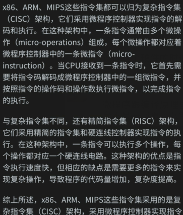
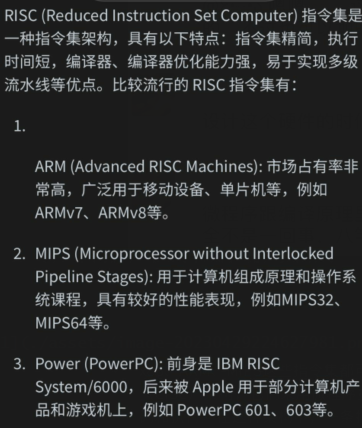
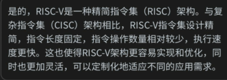
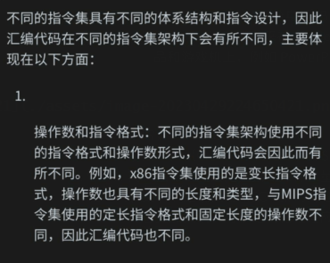
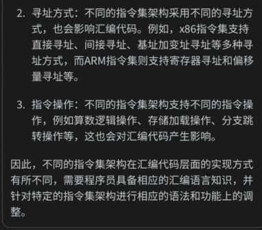
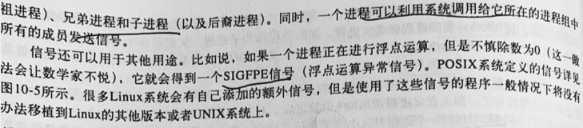

前期散列的列出来，针对暂时不理解的内容进行记录，后期整理并构建知识框架


408 100 王道的熟练掌握 120教材的绝对熟悉 130以上 黑书 作为科班对计算机的深入理解

## 前置内容

1.操作系统，微程序，编译器各自的职责?


补充：

1.

原语是一类特殊的操作，通常在操作系统的内核态下进行，用于实现操作系统的各种功能。它不是代码，而是一种由硬件提供的基本操作，例如访问共享资源、进程调度等。由于原语会涉及到底层硬件操作，因此需要在内核态下进行。在使用原语时，如果没有合适的原语可用，则需要使用系统调用来完成需要的操作。

2.

不一定是硬件开发人员提供的，原语有时也称作指令集扩展，是由CPU架构设计人员在CPU的指令集中添加的一组新指令，用于支持某些高级操作或特殊需求。它们通常被设计为在硬件配置上更高效，并且通常比软件实现更快捷，因此现代操作系统通常通过调用原语完成一些核心的操作，如内存管理、进程管理和文件管理等。

3.
是的，程序在被编译成机器码时，会包含操作码和地址信息。操作码指的是CPU指令集中的指令，它告诉CPU需要执行的具体操作，例如加法、乘法、移位等等。地址信息用来指定指令要操作的数据的位置，例如存储在内存中的变量的地址、I/O设备的地址等等。这些地址信息通常以二进制编码的形式嵌入到指令中，以便CPU能够正确地访问内存或者设备。通过操作码和地址信息，CPU可以准确地执行程序中的指令，并对数据进行读取、存储、计算等操作。

4.
CPU指令集并不是微指令，它提供的是一系列高级指令，也称为“操作码”。这些指令被CPU硬件执行时，会被转换成一条条微指令进行实际操作。微指令指的是CPU内部实际执行指令所需要的控制信号和数据传输信号，通常由硬件设计人员编写。简单地说，指令集是CPU能够执行的所有操作的列表，而微指令是指令集中每个操作的具体实现方式。


2.指令集







Q:为什么不同的指令集对应汇编语言不同





## 进程管理

1.线程

线程虽然拥有的资源少，但是他还是有自己的存储区，用于在线程切换时保存现场


2.



## 内存管理

1.与CO课的联系-多模块存储区

页框的地址一定是连续的吗，如果存储器是低位交叉编制的方式会不会有影响
应该不会
存储器具体寻址的方式对cpu来说是透明的，cpu寻址并不知道对应地址到底是不是同一个存储芯片
所以一定是连续的
按行存储和按列存储是什么意思
是不是高位交叉编制和低位交叉编制？

2.CO课的多模块存储


3.进入内核空间

在现代操作系统中，系统调用通常被实现为从用户态切换到内核态，以便访问受保护的内核资源。这种切换通常是由操作系统内核的代码实现的。一些常见的方法包括：

1.使用汇编语言

在汇编语言中，可以使用"int x80"指令来触发系统调用。当这个指令被执行时，CPU会自动将程序状态切换到内核态，并调用内核中相应的系统调用函数。例如，在Linux内核中，系统调用被定义为一个号码，可以用"eax"寄存器传递。在x86架构上，执行系统调用的汇编语句通常如下所示：

\```asm
  mov eax, 5  ; 5 is the system call number for open()
  mov ebx, filename
  mov ecx, flag
  int 0x80   ; invoke the system call
\```

2.使用C或C++库函数

在C或C++中，可以通过调用一个像"write()"或"read()"这样的函数来触发系统调用。这些函数通常是使用汇编代码编写的，并被链接到C或C++程序中。当调用这些函数时，程序状态会自动被切换到内核态，并调用内核中相应的系统调用函数。例如，在Linux内核中，"write()"函数可以在C程序中如下所示的调用：

\```c
  \#include <unistd.h>

  int write ( int fd, const void *buf, size_t count );
\```

3.使用特权级别提升

特权级别提升（privilege escalation）是指将当前进程的特权级别提高到内核态，以便能够访问和执行受保护的系统资源。这通常需要在内核代码中使用特殊的系统调用来实现，例如"setuid()"或"setgid()"函数在Linux中就是用来提升进程权限的。在某些情况下，建立信号传递机制或共享内存等需要使用内核API的用户进程，也需要先提升进程的权限，才能够正常执行内核API。


下面可以研究一下6.s081中进入内核态过程中发生的事

## 文件管理

1.文件在内存中的存储形式，在内核空间中存储了目录缓存，系统打开文件表，进程打开文件表


2.不理解的是系统调用到底怎么用，其实在C语言中想用read，open等系统调用一般都是用的库函数，这由C语言的库来提供，库调用OS提供的系统调用陷入内核，由OS帮助我们完成对应功能。下面是6.s081课程中相关的描述:

******


open,fopen,openf 这几个系统调用的区别


2.


3.unix打开文件的系统调用


4.内存映射文件


Q:内存映射文件是不是就是pipe管道?

A:不是，内存映射文件和管道是两个不同的概念。

内存映射文件是一种通过将文件或其他设备映射到内存中的方式来访问文件或设备的方法。通过内存映射文件可以将文件或设备的内容直接映射到进程的地址空间中，可以像访问内存一样访问文件或设备的数据。这种访问方式通常比传统的文件读写方式更快且更简单。在C++中，可以使用标准库中的mmap()函数来实现内存映射文件。

管道是一种将一个进程的输出连接到另一个进程的输入的方法。通过管道可以实现两个进程之间的通信，一个进程将数据输出到管道中，另一个进程再从管道中读取数据。在Linux系统下，可以使用pipe()函数来创建一个管道，然后使用fork()函数来创建子进程，从而实现进程间通信。

Q:这里的文件映射到内存的地址空间中，映射的是这个文件所有的数据块还是索引块，还是fcb?
A:当将文件映射到内存中时，映射的是整个文件的数据块，而不仅仅是索引块或 FCB（文件控制块）。这种映射方式可以让进程直接访问文件的数据，而无需使用传统的文件读写方式。从进程的角度来看，文件被映射到了进程的地址空间中，进程可以像访问内存一样访问文件的数据块，非常方便和高效。

需要注意的是，将整个文件映射到内存中可能会占用较多的内存空间，因此需要谨慎使用，特别是对于大文件而言。为避免内存资源的浪费，可以使用部分内存映射文件（Partial Memory-mapped Files）的方式，只将文件的一部分映射到内存中。在 C++11 标准库中，可以使用 std::mmap() 函数来实现内存映射文件。

Q:mmap提供的参数是文件描述符吗?
A:是的，mmap 函数的第一个参数是文件描述符，用于指定要映射到内存中的文件。文件描述符是一种在 Linux 系统中用于标识文件的方法，每个打开的文件都有一个唯一的文件描述符，可以通过系统调用如 open() 或 creat() 来获取文件描述符。

mmap 函数的第二个参数是映射区的长度，用于指定映射到内存中的文件或其部分的大小。第三个参数是映射区的访问权限，包括 PROT_READ（可读）、PROT_WRITE（可写）、PROT_EXEC（可执行）和 PROT_NONE（无访问权限）四种选项。第四个参数是映射区的特性，包括 MAP_SHARED（共享映射）和 MAP_PRIVATE（私有映射）两种选项。最后一个参数是文件偏移量，用于指定要映射的文件的起始位置。

为了准确使用 mmap 函数，需要对文件系统的相关知识有一定的了解。在使用时，通常需要先通过 open 函数获取文件的文件描述符，然后再调用 mmap 函数将文件映射到内存中。

Q:那么，如果修改映射到内存中的数据，OS在什么时候采用什么方式把内存中修改掉的数据写回磁盘的?
A:当你对内存映射文件做出修改操作时，本质上并未直接写入磁盘，而是将修改操作写入了操作系统内核的页缓存中，同时标记该页为“脏页”。当操作系统需要回收内存资源，或者程序需要释放内存映射区域时，内核会将脏页的内容自动写回磁盘文件。具体地说，当缓存中的脏页数量达到或超过操作系统设置的阈值时，或程序通过 msync() 系统调用强制将内容同步回磁盘时，就会触发写回操作。此外，OS也会在执行一些内部调度策略时，将脏页回写到磁盘。需要注意的是，操作系统的写回策略可能会导致修改的数据与内存中的数据不一致，因此需要根据具体的需求选择适当的写回方式，比如使用强制同步或者非延迟写回等方式。


5.管道

p42

6.


1.
在Linux系统中，一个磁盘可以被分为多个分区。每个分区都是一个独立的空间，它们之间互不干扰。但是在整个系统中，只有一个根目录“/”，而不是每个分区都有一个根目录。这是因为Linux支持在一个分区中创建多个挂载点，每个挂载点可以挂载到不同的目录上。

例如，在你的系统中，你可以将一个分区挂载到“/home”目录下，然后在该分区中创建一个“/home/user”目录，这个目录实际上是“/home”分区中的一个普通目录，而不是一个不同分区的根目录。同样的方式，你也可以将一个分区挂载到“/var”目录下，以用于保存系统日志等数据。

这种方式的好处是，它使得管理系统更加灵活。你可以根据需要选择将不同的分区挂载到不同的位置，以实现更好的数据组织和管理。

需要注意的是，挂载点的设置需要拥有管理员权限。在Linux系统中，只有特权用户（或者说超级用户，即root用户）才能进行这种操作。

2.
是的，虚拟文件系统（VFS）需要磁盘上的一个分区来存储文件数据和元数据。这个分区需要有一个根目录，在该目录下存储所有的文件和子目录。

当我们在操作系统中打开一个文件时，操作系统会将文件映射到一个文件描述符，并将该文件描述符与文件的虚拟节点关联起来。这个虚拟节点是一个内核数据结构，它包含了文件的元数据（例如文件权限、文件大小、文件类型等）以及文件数据在磁盘上的位置。

因此，VFS需要磁盘分区来存储文件数据和元数据，并使用虚拟节点来管理这些文件。

7.


8.为什么OS的文件系统没有讲到对换区?

文件的数据区是指保存文件数据的存储空间，一般由磁盘等外部存储设备来提供。而对换区（也称为交换区）指的是操作系统中的一块特定区域，用来保存将暂时不活跃的进程或进程的部分数据（如内存中的页面）转储到磁盘上，以释放内存空间以供其他进程使用。

在操作系统中，由于物理内存大小的限制，系统可能会将一些不活跃的进程或进程的某些部分数据从内存中调出（交换到对换区），以释放RAM内存，以便给其他活跃的进程或进程的数据提供更大的空间。当离开对换区后，操作系统可能会将进程或对应数据恢复到内存中，以便程序的执行和处理。

需要注意的是，对换区是与文件的数据区是不同的概念。文件的数据区属于文件系统的组成部分，而对换区是操作系统的内部架构所需的一个专用区域。

8.关于VFS 

1.vfs不存在于外存中
2.vfs在内存中的结构和其他fs的区别

VFS（虚拟文件系统）是一种文件系统抽象层，它在所有其他特定的文件系统之上工作。在内存中，VFS 维护了一个文件系统表的数据结构，该数据结构记录了所有挂载到系统的文件系统信息。每个文件系统信息（struct file_system_type）包含了实际文件系统对应的操作函数指针、文件系统名称、特性或其它元数据等信息。

当进程请求文件访问时，在操作系统内部，内核通过查找文件系统表来确定文件所在的具体文件系统类型，并将请求传递给该文件系统的操作函数。

相比之下，特定的文件系统在内存中的结构主要与其底层实现有关。例如，在 Linux 操作系统中，每个文件系统都有一个超级块（superblock）数据结构，该结构存储了文件系统的元数据，如磁盘的 block 大小、磁盘 inode 数量、文件系统使用的文件操作集等信息。

此外，文件系统还使用内存中的 inode 来跟踪和管理文件。inode 是一个数据结构，它包含了与文件相关的元数据和指向文件数据所在位置的指针。根据不同的文件系统实现，inode 可能包含不同的信息。

2.内核空间有什么
内核空间是操作系统内核运行的空间，它具有更高的特权级别，可以直接访问底层硬件资源和系统内存。在Linux系统中，内核空间包括以下内容：

1. 内核代码：包括内核核心代码和各种驱动程序，用于管理硬件和处理系统级别任务。


2. 进程和线程：内核负责进程和线程的创建、删除和管理，包括进程调度、进程通信等任务。


3. 内存管理：内核负责管理系统内存的分配、释放、映射等任务。


4. 文件系统：内核管理文件系统，包括文件的读写、目录的创建和删除等操作。


5. 网络协议：内核管理网络协议，包括网络层和传输层协议。


6. 设备驱动程序：内核管理设备驱动程序，与硬件交互实现设备的抽象和访问。


总之，内核空间拥有更高的权限和更广泛的职责，是Linux系统的核心。

是的，VFS的结构是存储在内存的内核空间中的。在Linux操作系统中，内核和用户空间是分离的，内核空间拥有更高的特权级别和更大的访问权限。因此，VFS的结构必须存储在内核空间中，以便内核可以访问和管理它。
vfs在内存中的结构是存储在内核空间的

3.用户空间有什么

用户空间包含了操作系统的应用程序和用户程序，是系统中应用程序运行的环境。用户空间通常是进程执行时所使用的空间，同时也是程序运行时的栈、堆和全局数据区等数据结构的存放地。用户空间还包括系统库、头文件、配置文件、静态数据等。与内核空间相比，用户空间的权限更低，对系统资源的访问受到限制。操作系统通过系统调用，提供一些接口供用户程序使用，以便用户程序能够与硬件设备和内核进行交互。


4.其他fs挂载到vfs上后，内存中也会有相应结构
是的，当其他文件系统（如Ext4、NTFS等）挂载到VFS上时，每个挂载的文件系统都会在内存中具有相应的数据结构。这些被挂载的文件系统的数据结构通常被存储在内存中的“超级块”结构中，这些超级块是被VFS用来管理每个挂载的文件系统的核心数据结构之一。当一个文件系统挂载到VFS上时，内核为其分配一块内存，用来存储文件系统特有的数据结构以及超级块结构。这些数据结构使得文件系统的访问和操作得到了高效的支持。当一个文件系统被卸载时，它的数据结构会被释放，并从内存中删除。

## IO管理

## TMP

### DS


### CO


### C++

人机求轻轻虐~ 2023/4/25 13:30:03
在一个函数声明中，const 关键字可以加在函数参数列表后面的方法名称后，也可以加在函数参数列表的右括号后。它的作用是修饰函数的常量性。

const 关键字加在函数名后面，表示该函数不会修改成员变量，即该函数是一个常量成员函数。例如：

class MyClass {
public:
  bool IsEmpty() const; // IsEmpty 是常量成员函数，不会改变成员变量的值
private:
  int m_Num = 0;
};

bool MyClass::IsEmpty() const {
  return m_Num == 0;
}
这里，IsEmpty 函数不会改变 m_Num 的值，因此它被声明为一个常量成员函数，并在其定义中使用 const 关键字来指定该函数的常量性。

在这个例子中，const 关键字直接加在方法名 IsEmpty 的后面，这意味着该函数不会修改任何的成员变量。而如果 const 加在参数列表后面，则表示该函数不会修改传递给它的任何参数。

对于上面提到的案例中的声明：

virtual JsonType GetType() const;
它指定了 GetType 函数是一个常量成员函数，并且其返回值类型为 JsonType。这意味着，在这个函数中，不会修改任何成员变量，也不会修改任何参数的值。

人机求轻轻虐~ 2023/4/25 13:30:10
virtual void makeSound() = default; 是在 C++11 中引入的一种语法，它的意思是将该虚函数的默认实现设为默认实现。在这种情况下，该虚函数的实现将被自动继承，不需要在子类中重新实现。

使用 = default 的情况下，编译器将提供一个默认实现，这个默认实现是按照以下规则进行的：

如果虚函数是析构函数，则默认实现是析构对象的成员和基类。
如果虚函数没有参数，则默认实现是空函数。
如果虚函数有参数，则不能使用 = default 关键字。
需要注意的是，如果你在虚函数中定义了自己的实现，那么 = default 将不再起作用，编译器将使用你的自定义实现，而不是默认实现。

人机求轻轻虐~ 2023/4/25 13:30:17
虚类是指含有至少一个纯虚函数的抽象类，纯虚函数是用 = 0 来赋值的。虚类本身是不能进行实例化的，只能作为基类被继承。因此，虚类也不能被直接赋值。

需要注意的是，在子类中必须实现虚基类中的纯虚函数，否则该子类也会变成一个抽象类不能被实例化。 当子类继承了虚类并实现了其中的纯虚函数后，子类的对象便可以被实例化并使用。

人机求轻轻虐~ 2023/4/25 13:46:09
这是一个 C++ 中的 std::pair 类型，用来存储键值对。其中，键的类型是 std::string，值的类型是指向 JsonValue 对象的指针。std::pair 类型可以用来在一些容器中存储和访问键值对，比如 std::map 或者 std::unordered_map。通常，在实现一个包含键值对的数据结构时，我们需要定义类似于 std::pair 这样的类型来表示一个键值对。下面是一个简单的示例，展示了如何使用 std::pair 类型来存储和访问键值对：

\```c++
\#include <iostream>
\#include <utility> // 包含 std::pair 类型

int main() {
  // 定义一个 std::pair 类型的对象，并初始化它的键值对
  std::pair<std::string, int> p1("answer", 42);

  // 访问 std::pair 对象的键和值
  std::cout << "The answer is " << p1.second << std::endl;

  // 修改 std::pair 对象的值
  p1.second = 99;

  // 将 std::pair 对象作为元素插入到 std::map 容器中
  std::map<std::string, int> myMap;
  myMap.insert(p1);

  // 遍历 std::map 容器并输出键值对
  for (const auto& p : myMap) {
    std::cout << "Key: " << p.first << ", Value: " << p.second << std::endl;
  }

  return 0;
}
\```

在上述示例中，我们定义了一个 std::pair 类型的对象 `p1`，它的键类型是 std::string，值类型是 int。我们可以使用 `p1.first` 和 `p1.second` 来访问其键和值。我们还可以将 `p1` 对象作为元素插入到 `std::map` 容器中，并遍历 `std::map` 容器来输出其中的键值对。类似这样的方式，我们可以使用 `std::pair` 来存储和访问各种类型的键值对。

人机求轻轻虐~ 2023/4/25 15:15:53
`static_cast` 是C++的一种类型转换运算符，它可以在编译时将一种数据类型转换为另一种数据类型。

`static_cast` 可以用于执行以下类型转换：

\- 通常类型转换，例如将 `int` 转换为 `double` 或将指针转换为 `void*`。
\- 保留符号类型转换，例如将 `int` 转换为 `char`。
\- 静态向下转换（在运行时不进行动态类型检查），例如将父类指针转换为子类指针。
\- 将枚举类型转换为整数类型或整数类型转换为枚举类型。

以下是使用 `static_cast` 进行类型转换的示例：

\```cpp
\#include <iostream>
using namespace std;

int main() {
  int i = 4;
  double d = 3.14;
  
  // 将 int 转换为 double
  double result1 = static_cast<double>(i);
  cout << "result1: " << result1 << endl;
  
  // 将 double 转换为 int
  int result2 = static_cast<int>(d);
  cout << "result2: " << result2 << endl;
  
  // 静态向下转换，将父类指针转换为子类指针
  class BaseClass {
    // ...
  };
  class DerivedClass : public BaseClass {
    // ...
  };
  BaseClass *basePtr = new DerivedClass();
  DerivedClass *derivedPtr = static_cast<DerivedClass*>(basePtr);

  return 0;
}
\```

在这个示例中，我们首先将 `int` 类型的 `i` 转换为 `double` 类型 `result1`。我们还将 `double` 类型的 `d` 转换为 `int` 类型 `result2`。此外，我们使用 `static_cast` 将基类指针 `basePtr` 转换为子类指针 `derivedPtr`。需要注意的是，在进行静态向下转换之前，必须将基类中的函数定义为虚函数。